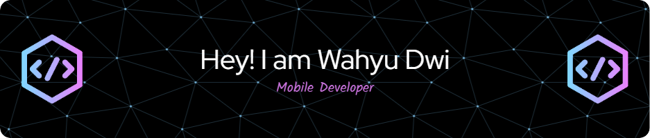

- 👋 Hi, I’m Dwi
- 🏢 I'm currently working on @Universitas Amikom Yogyakarta
- 👀 I’m interested in Mobile Development
- 📫 You can reach me through wdwihartarto@gmail.com
- 🌱 I’m currently learning Multiplatform framework like flutter and KMP

##### Skills
   

##### Connect with me
 
